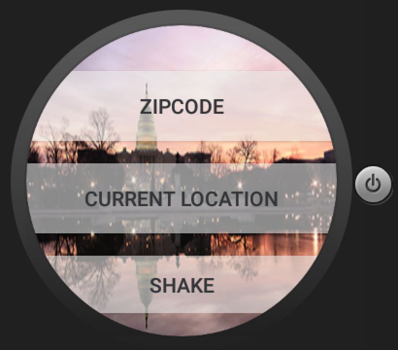

# PROG 02: Represent!

Represent is an app designed to educate users on the political representatives in their area.
Use it to see who your congressional representatives are and their vital information.
Stay informed about current events in your area!

## Authors

Michelle Chang ([michang@berkeley.edu](mailto:michang@berkeley.edu))

## Demo Video

See [your demo video title here] (https://link_to_your_video)

## Screenshots

## Acknowledgments

* CS160 staff for their Catnip starter code
* [peceps](http://stackoverflow.com/questions/2317428/android-i-want-to-shake-it) from StackOverflow
